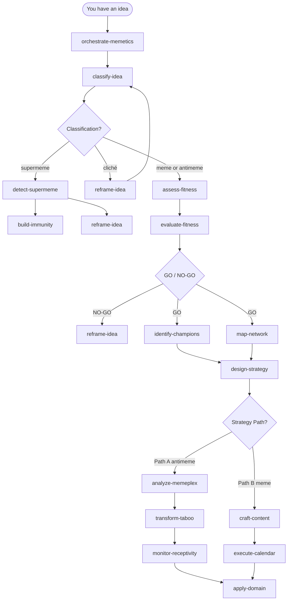

# Memetics Plugin

**Memetics is the science of how ideas spread, replicate, and die.** Every campaign that went viral, every product that created a new category, every movement that shifted culture — these all followed patterns. This plugin gives you 16 AI skills built on those patterns, so you can analyze any idea, decide whether it's worth spreading, design a multi-year strategy to spread it, and defend against ideas that waste your time.

Works in **Cursor** and **Claude Code**. No dependencies. Pure skill files.

---

## Who This Is For

### Entrepreneurs

You have an idea that could reshape a market, but the market doesn't know it needs reshaping yet. That's the classic antimeme problem: high value, low transmission. The hardest part isn't having the idea — it's getting anyone to care before you have social proof.

**What this plugin helps you do:**

- **Diagnose why your messaging isn't landing.** `classify-idea` tells you whether you're dealing with low transmissibility (antimeme) or a genuinely worn-out concept (cliché), and the fix is different for each.
- **Decide if an idea is worth a multi-year commitment** before spending years on it. `assess-fitness` runs a GO/NO-GO with five yes-criteria and five no-go flags, including the one most founders miss: whether you have even one person willing to champion this for 3–5 years.
- **Build a launch strategy that accounts for network immunity.** `design-strategy` produces a phased plan — dark forest incubation, coordinated emergence, tipping point — calibrated to how resistant your target network is.
- **Catch when your company is being consumed by a supermeme** — a compelling but unproductive idea (a tech trend, an ideological frame, a competitor narrative) that's eating all the oxygen. `detect-supermeme` surfaces it and recommends containment.
- **Build your founder personal brand as a memetic system** — not just "post content," but a villain, a memetic library, a ritual, a niche, and secondary channels. `apply-domain` adapts all of this to the personal branding context.

**Example starting prompt:**
> "I'm building a developer tool that replaces a workflow most developers don't realize is broken. I have a strong conviction but no traction. Help me figure out what kind of idea this is and whether I should invest in spreading it."

---

### Marketers

You know that most viral content isn't random. You also know that most "viral strategy" advice is shallow. This plugin goes several layers deeper — into the actual mechanics of transmission, immune networks, champion dynamics, and the difference between content that spreads and content that converts.

**What this plugin helps you do:**

- **Architect content that spreads by design.** `craft-content` produces 3–5 ready-to-post variants from a single core message — villain narrative, validation, hope/progress, humor, and curiosity — with transmissibility and risk assessment for each. It also explains *why* each variant works via mimetic desire theory.
- **Run narrative warfare against incumbents** without wasting budget on noise. `design-strategy` Path B gives you the viral meme playbook: 3–5 posts/day, primary/secondary account strategy, villain framing, coordination patterns.
- **Detect when your own campaign has become a supermeme trap** — consuming budget and attention without producing conversions. The five red flags in `detect-supermeme` apply to campaigns as well as ideas.
- **Map your target network before you launch** to avoid wasting effort on immune audiences. `map-network` recommends dense (private groups), sparse (public platforms), or hybrid topology based on four network dimensions.
- **Analyze the full memeplex** around a market position — what other ideas reinforce or compete with yours, where mimetic desire flows in your category, and where the institutional bottlenecks are. `analyze-memeplex` surfaces the competitive idea landscape.
- **Transform taboo or counterintuitive positioning** into mainstream acceptance over a designed timeline. `transform-taboo` gives you the 5–10 year inoculation strategy, with case studies from political and tech contexts.

**Example starting prompt:**
> "We're a challenger brand in a category dominated by a legacy player with massive brand recognition. I need to figure out what memetic strategy to use — do we attack directly, create a new category narrative, or find a niche and grow from there?"

---

### Product People

You deal with the antimeme problem constantly. New features don't get adopted because they require behavior change. New product categories don't spread because people don't have the vocabulary. Internally, you need leadership to buy into a product direction they can't fully evaluate yet. All of these are memetics problems.

**What this plugin helps you do:**

- **Diagnose adoption friction.** A feature that no one uses isn't a UX problem by default — it might be an antimeme problem (high value, low transmissibility). `classify-idea` + `evaluate-fitness` gives you the transmission rate, network immunity level, and symptomatic period for a feature or idea, letting you prescribe the right fix.
- **Position a new product category** that doesn't have existing vocabulary. `design-strategy` Path A (dark forest → tipping point) is exactly the playbook for seeding a new mental model privately among early believers before pushing for scale.
- **Get internal buy-in for a direction that's ahead of the organization's current thinking.** `identify-champions` helps you find and recruit the 2–3 people who will advocate persistently, maps their roles (Patient Zero, Language Creator, Network Connector, Implementer), and gives you the recruitment playbook.
- **Plan a product launch that does memetic groundwork first** — seeding belief privately, identifying validators, building network sediment — instead of just going wide on launch day. `apply-domain` has a specific product launch playbook.
- **Recover stuck ideas.** When positioning has failed or a concept has gone stale, `reframe-idea` gives you three transformation paths: cliché recovery, supermeme narrowing, or full NO-GO restructuring.
- **Know when the organization or market is ready to move to the next phase** rather than pushing too early. `monitor-receptivity` tracks five signal types that indicate readiness: organic discussion, validator emergence, reduced social cost, linguistic shift, and growth metrics.

**Example starting prompt:**
> "We've built a feature that solves a real problem but barely anyone uses it. The team is starting to question whether the idea was wrong. Help me understand if this is actually a bad idea or just a spread/adoption problem."

---

## The 16 Skills

### Entry Point / Orchestration

| Skill | Key Question | What It Does |
|---|---|---|
| `orchestrate-memetics` | *Where do I start?* | Intelligent router for the entire system. Analyzes your request, selects the right starting skill, chains outputs across the session, and explains its reasoning. Use this when you're not sure which skill applies. |

### Classification & Analysis

| Skill | Key Question | What It Does |
|---|---|---|
| `classify-idea` | *What kind of idea is this?* | Classifies any idea into meme (high spread, lower impact), antimeme (low spread, high impact), supermeme (high spread, parasitic), or cliché (formerly a meme, now worn out). Uses a 3-property matrix + 5-flag supermeme check. |
| `evaluate-fitness` | *What are the exact transmission metrics?* | Measures the three variables that determine spread: K-factor (transmission rate), network immunity level, and symptomatic period. Produces a composite fitness profile ("Natural Meme," "Challenging Antimeme," etc.). |
| `analyze-memeplex` | *What's the full idea ecosystem?* | Maps the cluster of reinforcing ideas around a concept, competing memeplexes, mimetic desire dynamics (Girard's Subject/Object/Model triangle), institutional reinforcement, and vulnerability points. |

### Strategic Decision

| Skill | Key Question | What It Does |
|---|---|---|
| `assess-fitness` | *Should I try to spread this?* | GO/NO-GO gatekeeper. Five YES criteria (high impact, 3–5 year champion available, early believers identified, favorable network, strategic clarity) and five NO-GO flags (low impact, supermeme, no champion, immune network, ego-driven). |
| `detect-supermeme` | *Is this a trap?* | Scores five red flags for parasitic supermemes: apocalyptic framing, vague goals, "save the world" appeals, total prioritization demands, no success metrics. Recommends time-boxing, reframing, or building immunity. |

### Network Strategy

| Skill | Key Question | What It Does |
|---|---|---|
| `map-network` | *How do I structure the spread?* | Recommends optimal topology: dense (private group chats for antimeme incubation), sparse (public platforms for viral scale), or hybrid (develop privately, emerge publicly). Analyzes density, homogeneity, context, and formality. |

### Execution Strategy

| Skill | Key Question | What It Does |
|---|---|---|
| `design-strategy` | *What's the plan?* | Creates the complete phased strategy. Path A (antimeme): Dark Forest → Coordinated Emergence → Tipping Point. Path B (meme): viral content tactics. Includes timelines, milestones, champion role assignments, and contingency plans. |
| `identify-champions` | *Who will fight for this?* | Finds and recruits the 2–3 people willing to advocate for 3–5+ years. Defines four champion functions: Patient Zero (public face), Language Creator (writer/articulator), Network Connector (bridges communities), Implementer (builds evidence). |
| `craft-content` | *What do I post?* | Creates 3–5 ready-to-post content variants from a core message. Five formats: outrage/villain, validation, hope/progress, humor, curiosity. Includes transmissibility assessment, risk level, and primary vs. secondary account recommendation. |
| `execute-calendar` | *When and where do I post it?* | Schedules approved content: 3–5 posts/day, platform-specific timing, content rotation patterns, primary/secondary account assignment. References the Ukraine dual-account meme warfare model and the 1up Sales SaaS meme case. |

### Specialized Handling

| Skill | Key Question | What It Does |
|---|---|---|
| `transform-taboo` | *How do I make a controversial idea acceptable?* | Designs a 5–10 year phased transformation from rejection to mainstream: private development → gradual inoculation (network sediment filter) → coordinated emergence. Covers why slow acceptance protects network stability. |
| `monitor-receptivity` | *Is it time to advance phases?* | Tracks five readiness signals: organic discussion, validator emergence, reduced social cost, linguistic shift (crazy → interesting), and growth metrics. Provides explicit decision rules for phase advancement. |
| `reframe-idea` | *This idea isn't working — what now?* | Salvages failed or stuck ideas without losing the core insight. Three transformation paths: cliché recovery (contrarian inversion, specificity injection), supermeme narrowing (scope reduction, metric attachment), and NO-GO restructuring. |

### Defense & Adaptation

| Skill | Key Question | What It Does |
|---|---|---|
| `build-immunity` | *How do I protect my team/network?* | Strengthens a network's resistance to harmful memes and supermeme parasites. Tactics: gradual idea exposure, "Gullibility Vaccine" (critical evaluation frameworks), explicit decision protocols, cross-network ties. Introduces "vaccimes" — meme-eating memes like skepticism. |
| `apply-domain` | *How does this apply to my specific context?* | Adapts general memetics strategy to three domains: **personal branding** (memetic library, villain, rituals, niche, secondary channels), **product launches** (meme + antimeme combo strategy, narrative warfare), and **social movements** (dark forest → tipping point, 5–10 year timeline). |

---

## Workflow



---

## Installation

### Cursor

```bash
git clone https://github.com/gnurio/memetics-plugin ~/.cursor/plugins/local/memetics-plugin
```

Restart Cursor. All 16 skills are auto-discovered from `skills/`.

### Claude Code

```bash
git clone https://github.com/gnurio/memetics-plugin
```

Reference it for a single session:

```bash
claude --plugin-dir ./memetics-plugin
```

Or add it permanently via the Claude Code TUI:

```
/plugin add ./memetics-plugin
```

Once listed in the marketplace:

```bash
claude plugin install memetics-plugin
```

---

## Quick Start

Three archetypal scenarios with exact starting prompts.

### Founder: New category, no traction

```
Use orchestrate-memetics.

I'm building [product] that does [thing]. My target market is [audience].
I have strong conviction this matters but I'm getting blank stares when
I pitch it. I don't know if the idea is bad or just hard to transmit.
Help me understand what I'm dealing with and whether to invest in spreading it.
```

Expected path: `classify-idea` → `assess-fitness` → `identify-champions` → `design-strategy` (Path A)

---

### Marketer: Challenger brand needing narrative traction

```
Use craft-content.

My product is [product]. The incumbent in the market is [competitor].
Their narrative is [their framing]. My core message is [your message].
Target audience: [audience]. Platform: [platform]. I need 4–5 content
variants I can test this week — and I want to know which ones carry risk.
```

Expected path: `craft-content` → `execute-calendar`, optionally `map-network` first

---

### PM: Feature with adoption problem

```
Use classify-idea.

We launched [feature] [X weeks/months] ago. It solves [problem].
Adoption is at [metric]. The team thinks the idea might just be wrong.
I think it's a spread problem, not a value problem. Help me figure out
which it is, and if it's a spread problem, what to do about it.
```

Expected path: `classify-idea` → `evaluate-fitness` → `reframe-idea` or `design-strategy`

---

## Confirmed vs. Speculative

10 skills are fully grounded in source material. 4 have scaffolding with explicit gaps marked `[NEEDS SOURCE MATERIAL]`.

| Skill | Status | Gap (if speculative) |
|---|---|---|
| `classify-idea` | Confirmed | — |
| `assess-fitness` | Confirmed | — |
| `map-network` | Confirmed | — |
| `design-strategy` | Confirmed | — |
| `craft-content` | Confirmed | — |
| `identify-champions` | Confirmed | — |
| `detect-supermeme` | Confirmed | — |
| `transform-taboo` | Confirmed | — |
| `evaluate-fitness` | Confirmed | — |
| `reframe-idea` | Confirmed | — |
| `analyze-memeplex` | Confirmed | — |
| `orchestrate-memetics` | Confirmed | — |
| `monitor-receptivity` | Speculative | Specific behavioral indicators and quantitative measurement methods needed |
| `build-immunity` | Speculative | Detailed immunity-building curricula and measurement frameworks needed |
| `execute-calendar` | Speculative | Platform-specific optimal timing and content rotation formulas needed |
| `apply-domain` | Speculative | Full step-by-step playbooks for each domain needed |

Speculative skills aren't broken — they include what's known from source material, explicit gap markers, and scaffolding. They're usable; they're just honest about where the methodology needs more depth.

---

## Philosophy

This plugin does one thing: extract the actionable procedural knowledge from a body of work on memetics and make it reusable as AI skills.

**MECE decomposition.** Every skill has a distinct responsibility. No two skills do the same thing. Every piece of source material maps to exactly one skill. This means the orchestrator can route cleanly and skills can chain without contradiction.

**Explicit I/O contracts.** Each skill defines exactly what it accepts and what it produces. This enables intelligent chaining — the output of `classify-idea` is the correct input format for `assess-fitness`, which feeds into `design-strategy`, and so on.

**Speculative honesty.** Rather than hallucinating a complete methodology where source material is thin, speculative skills mark their gaps with `[NEEDS SOURCE MATERIAL]` and show exactly what's missing. This is more useful than confident nonsense.

**Source fidelity.** Every confirmed skill traces back to specific material. Examples used in skills are drawn from real cases: Ukraine's dual-account meme warfare model, the Yarvin/NRx dark forest emergence, effective altruism's antimeme trajectory, 1up Sales SaaS meme account.

---

---

## Source Material

This plugin is built directly from these texts — not adjacent inspiration, but the actual frameworks the skills implement.

| Source | Author | What It Contributes |
|---|---|---|
| *Antimemetics* | Nadia Asparouhova & Leïth Benkhedda (2025) | Primary source. The full meme/antimeme/supermeme/cliché taxonomy, dark forest model, champion theory, tipping point mechanics, and the case against supermeme traps. |
| *There Is No Antimemetics Division* | qntm | Where the concept of "antimeme" originated — self-erasing information that resists being held in mind. The SCP Foundation fiction that Nadia's framework builds on. |
| ["The Tyranny of Ideas"](https://nadia.xyz/ideas) | Nadia Asparouhova | Ideas as living entities with agency over their creators. Philosophical grounding for treating idea transmission as a design problem, not a luck problem. |
| "I Read a 30-Page Paper on Memes" | Jason Levin | Practical warfare layer: Ukraine's dual-account model, villain narrative mechanics, the 1up Sales SaaS meme case, NATO's definition of memetic warfare. |
| *Deceit, Desire, and the Novel* | René Girard | Mimetic desire theory — the Subject/Object/Model triangle that underlies `analyze-memeplex` and why ideas spread through imitation of desire, not direct persuasion. |

*Status: 12 confirmed skills, 4 speculative with explicit gap markers*
